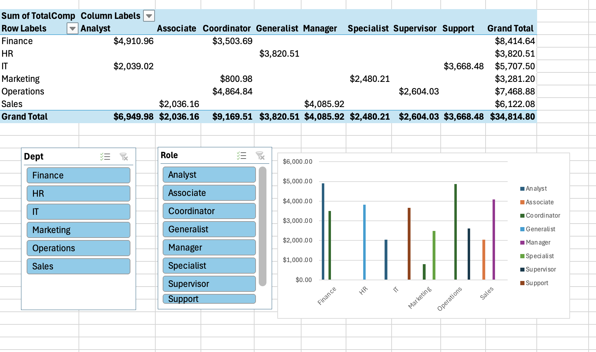

# Excel — Employee Salary Dashboard  

**Goal:** Build a 1-page dashboard that calculates and visualizes employee compensation (Base Pay, Overtime, Bonus, and Total Compensation) by Department and Role.  

## Dataset  
- **Source:** `employees.csv` (30 employees across multiple departments and roles)  
- **Fields:** Dept, Role, HourlyRate, Hours, OvertimeHours, BonusPct  

## Steps  
1. Open `employees.csv` in Excel and format as a table.  
2. Add calculated columns:  
   - **BasePay** = HourlyRate × Hours  
   - **OTPay** = 1.5 × HourlyRate × OvertimeHours  
   - **BonusAmt** = BonusPct × (BasePay + OTPay)  
   - **TotalComp** = BasePay + OTPay + BonusAmt  
3. Build a PivotTable summarizing TotalComp by Dept and Role.  
4. Add slicers for Dept and Role to enable interactive filtering.  
5. Create a Clustered Column chart showing TotalComp by Dept.  
6. Save as `dashboard.xlsx` and capture a screenshot (`dashboard.png`).  

## Dashboard  
  

## Findings  
- **Operations** had the highest overall compensation across all departments.  
- **IT roles** showed higher reliance on overtime pay relative to base salary.  
- **Sales roles** saw bonuses significantly increase their total compensation.  
