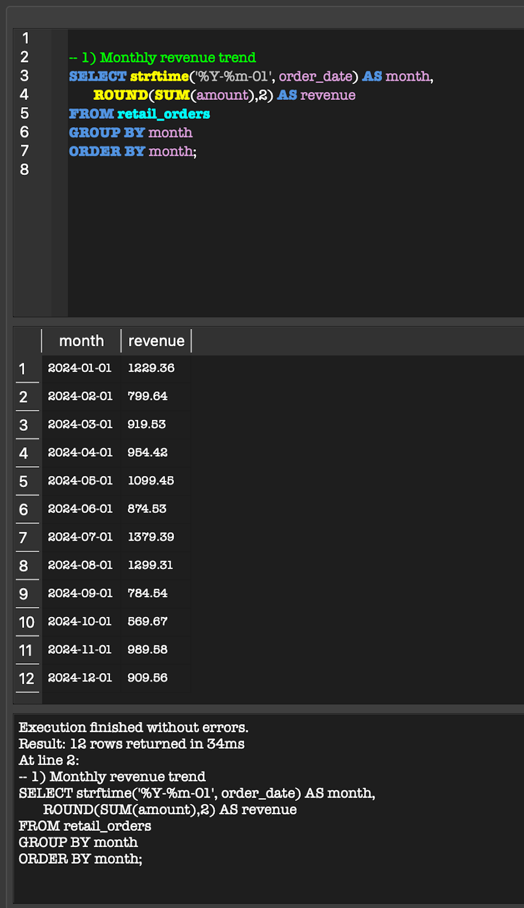
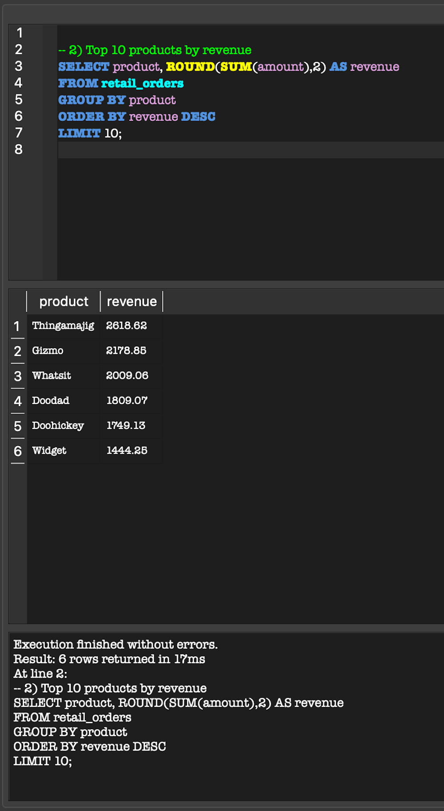
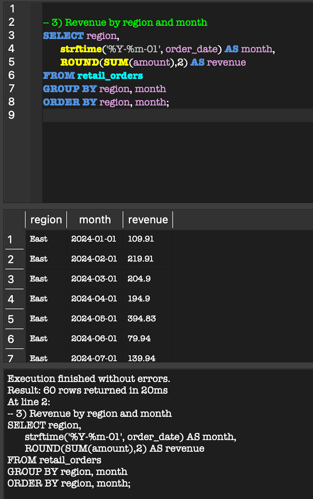
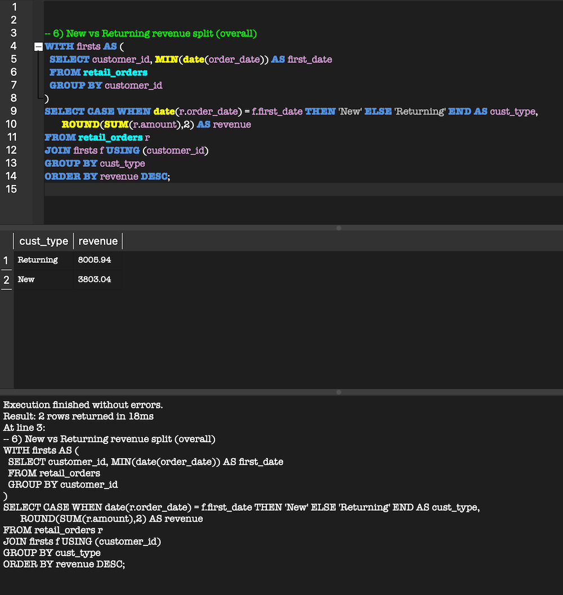

# SQL — Retail Sales Analysis

**Goal:** Analyze retail sales to uncover trends, product performance, regional differences, and customer behavior using SQL.

## Dataset
- **Source:** `retail_orders.csv` (~300 synthetic orders)
- **Fields:**  
  `order_id`, `order_date`, `customer_id`, `product`, `category`, `region`, `quantity`, `price`, `amount`

## How to Run (SQLite)
1. Create a database `retail.db` and a table `retail_orders` (DB Browser for SQLite recommended).  
2. Import `retail_orders.csv` with the header row.  
3. Open `queries.sql` and run each query in order.  

## Business Questions Answered
1. Monthly revenue trend  
2. Top 10 products by revenue  
3. Revenue by region and month  
4. Average order value (AOV) by month  
5. First order date per customer  
6. New vs Returning revenue (overall)  
7. New vs Returning revenue (by month)  
8. Top customers by lifetime revenue  
9. Category mix by region  
10. Contribution of Top 5 products  
11. Cumulative revenue over time  
12. Top product each month (dense rank)  

## Key Findings
- Top 5 products contributed **~88%** of total revenue.  
- **Returning customers** generated over **65%** of revenue.  
- **North** and **Online** regions were the strongest performers, each crossing ~$3k in sales.  
- Average Order Value (AOV) ranged from ~$32 to ~$47 depending on the month.  
- Product **Gizmo** consistently appeared as a top seller across multiple months.  

## Example Outputs

**Monthly Revenue Trend**  

**Top Products by Revenue**  

**Revenue by Region and Month**  

**New vs Returning Revenue by Month**  

